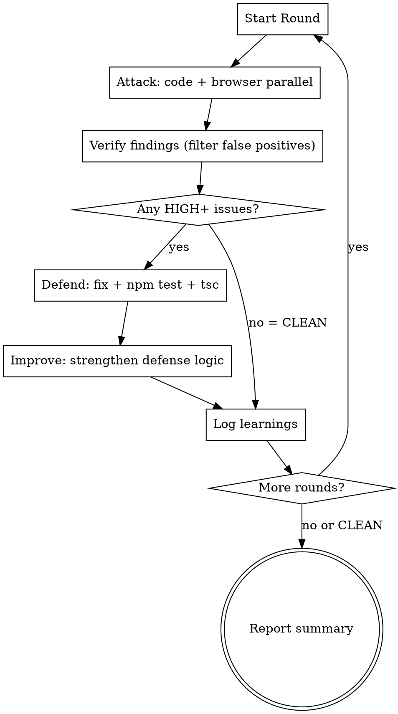

# Attack-Defense Cycle

Iteratively find and fix security vulnerabilities by playing attacker then defender, N rounds.

## When to Use

- User asks for repeated security analysis + fixing
- "공격/방어 3라운드 돌려줘"
- "심층분석하고 HIGH까지 수정을 5번 반복"
- After major feature implementation to harden security

## Process (Per Round)



## Round Themes

| Round | Theme | Attack Focus |
|-------|-------|-------------|
| R1 | Auth/Session | Cookie forgery, token replay, JWT manipulation, privilege escalation |
| R2 | Bot Evasion | Guard chain bypass, fingerprint spoofing, rate limit circumvention |
| R3 | Infrastructure | DoS, memory exhaustion, cache manipulation, config misuse |
| R4 | Cross-Fix Interaction | Bugs created by previous fixes interacting, multi-step attack chains |
| R5 | Final Pentest | Full re-attack on all previous fixes. CLEAN = success |

## Attack Phase

Dispatch TWO agents in parallel:

**Agent 1 — Code Analysis (Explore subagent):**
- Read all guards, services, controllers, cache, config
- Find exploitable issues with CONCRETE attack steps
- Focus on current round's theme

**Agent 2 — Browser Pentest (general-purpose subagent):**
- Playwright headed mode, 150ms delays between requests
- Active exploitation attempts (cookie forgery, JWT attacks, fuzzing)
- Screenshots saved to /tmp/r{N}-*.png

## False Positive Filter (CRITICAL)

Before fixing, verify each finding against these rules:

| AI Claim | Reality | Action |
|----------|---------|--------|
| "Memory cache race condition" | Node.js single-threaded, sync Map ops = no interleaving | REJECT |
| "HMAC brute force possible" | SHA-256 + 64-byte key = computationally impossible | REJECT |
| "Plaintext transmission" | HTTPS in production | REJECT |
| "Open redirect via returnUrl" | Code uses pathname only, not hostname | REJECT |
| "getAndDelete not atomic" | Sync Map.get + Map.delete, single-threaded = atomic | REJECT |
| Design choices (thresholds, TTLs) | Intentional, not vulnerabilities | REJECT |

**Read the actual code before accepting any finding.**

## Defend Phase

1. Fix only verified HIGH+ issues
2. Run `npm test` — all must pass
3. Run `npx tsc --noEmit` — must be clean
4. Update tests if behavior changed

## Improve Phase

Beyond fixing, strengthen defenses:
- Add new detection rules for the attack pattern
- Tune guard thresholds/weights
- Add logging for attack visibility
- Add test cases to prevent regression

## Output Format

Per round:
```
R{N} 🔴 Attack: {count} issues — {summary}
R{N} 🔵 Defend: {count} fixed — {summary}
R{N} 🟢 Improve: {enhancement summary}
```
Or: `R{N}: CLEAN — no issues found`

Final: summary table + commit offer.

## Early Termination

Stop when:
- CRITICAL/HIGH = 0 AND no defense improvements needed
- Two consecutive CLEAN rounds

## Common Mistakes

- Accepting AI findings without reading actual code (30%+ are false positives)
- Fixing design choices that are intentional
- Not checking if "new" findings were already fixed in previous rounds
- Skipping the improve phase (fixing without strengthening)
