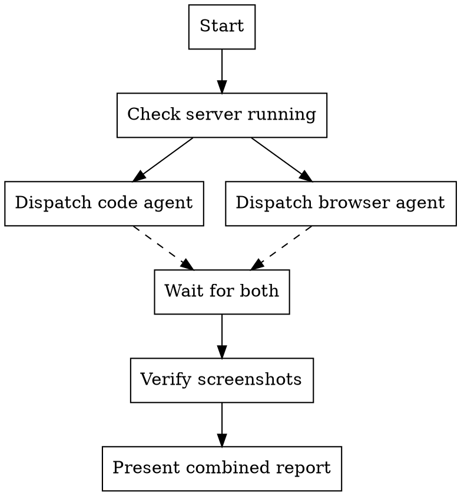

# Deep Analysis

Comprehensive code analysis + real browser functional testing, executed in parallel.

## When to Use

- "심층분석해봐"
- "코드 분석하고 브라우저로도 확인해봐"
- After completing a feature or fix
- Before committing/pushing major changes
- Periodic security/quality audit

## Process



**Both agents run in background (parallel).** Do not duplicate work between them.

## Agent 1: Code Analysis (Explore subagent)

Dispatch with these focus areas:

```
Focus areas:
1. Security — guards, auth, crypto, input validation, info leakage
2. Architecture — module structure, circular deps, layer separation
3. Code Quality — TypeScript strictness, error handling, memory leaks
4. Test Coverage — untested critical paths, edge cases
5. Production Readiness — Docker, env vars, graceful shutdown
```

Key files to always check:
- `src/common/guards/*.ts`
- `src/common/services/*.ts`
- `src/features/auth/auth.service.ts`
- `src/core/cache/*.ts`
- `src/core/config/config.schema.ts`
- `src/main.ts`
- `Dockerfile`

Report format: File:line, Severity (CRITICAL/HIGH/MEDIUM/LOW), Description, Impact.

## Agent 2: Browser Testing (general-purpose subagent)

Dispatch with:
- `npx playwright install chromium` first
- headless: false (headed mode, user can see)
- 150ms delays between requests
- Screenshots saved to /tmp/

### Standard Test Plan

| Group | Tests |
|-------|-------|
| A. Core | GET /, /health, /health/live, /health/ready |
| B. Guard Chain | Protected endpoint without cookie → 403, response format check |
| C. Auth | Bad login → 401, missing fields → 400, admin without JWT → 403 |
| D. Security Headers | Helmet headers present, X-Powered-By absent |
| E. Rate Limiting | Health exempt, protected endpoints throttled |
| F. WebSocket | Socket.io SID, no-auth rejection |
| G. Edge Cases | 404, empty UA, SQL injection, XSS, oversized body |
| H. Challenge Flow | Navigate to protected endpoint, observe challenge/CAPTCHA |

### Optional Groups (add when relevant)

| Group | When |
|-------|------|
| Cookie Security | After auth/challenge changes |
| Mobile UX | After UI changes |
| Pentest Attacks | After security hardening |

## Combining Results

After both agents complete:

1. **Read screenshots** — verify visual state matches expectations
2. **Cross-reference** — code issues that explain browser test failures
3. **Present unified report:**

```
## Code Analysis: {CRITICAL} C / {HIGH} H / {MEDIUM} M / {LOW} L
## Browser Test: {PASS}/{TOTAL} tests

### Issues Found
| # | Source | Severity | Description |
...

### All Tests Passed
| # | Test | Result |
...
```

## Quick Reference

| Task | Agent | Type |
|------|-------|------|
| Code review | Explore subagent | run_in_background: true |
| Browser test | general-purpose subagent | run_in_background: true |
| Screenshot verification | Read tool (main context) | After agents complete |
| Server health check | `curl localhost:3000/health` | Before dispatching agents |

## Before Dispatching

Always verify server is running:
```bash
lsof -i :3000 -t 2>/dev/null | head -1
```

If not running:
```bash
npm run start:dev > /tmp/server.log 2>&1 &
sleep 5 && curl -s http://localhost:3000/health
```

## Common Mistakes

- Dispatching browser agent when server is down
- Duplicating code analysis work that the agent is already doing
- Not reading screenshots after browser test completes
- Reporting browser test WARN as FAIL (Playwright headless detection is expected)
- Running agents sequentially instead of in parallel (wastes time)
